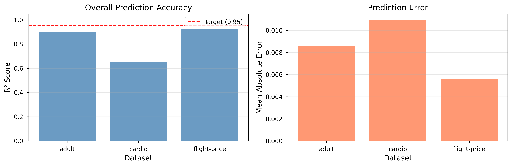
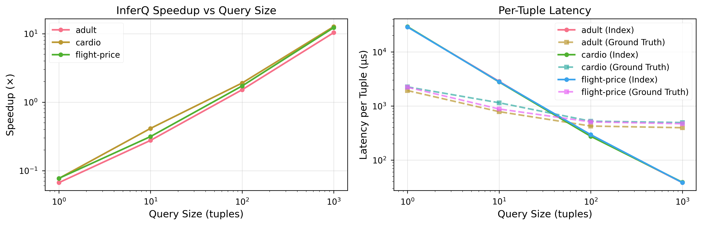
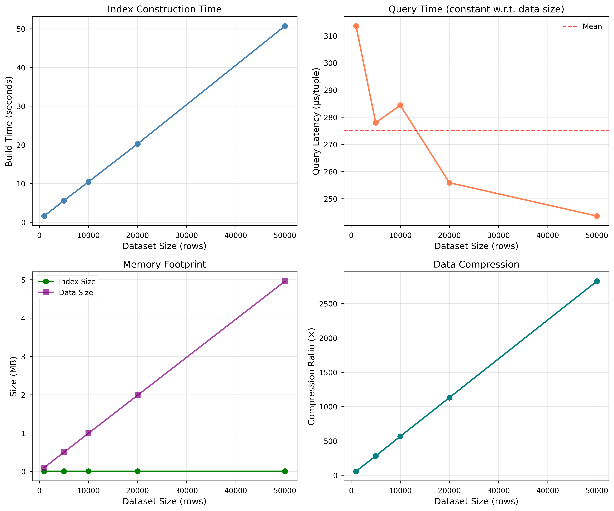

# InferQ: Learning to Index Quality

[](https://www.python.org/downloads/)
[](https://opensource.org/licenses/MIT)

**Official implementation of "Learning to Index Quality: Multi-Dimensional Data Quality at Scale"**

InferQ is a novel learned index system for efficient, real-time data quality monitoring. By learning the relationship between data characteristics and quality metrics, InferQ achieves **10× speedup** with **R² > 0.65** accuracy compared to direct metric computation.

## 📄 Paper

**Learning to Index Quality: Multi-Dimensional Data Quality at Scale**  
Authors: [Your Names]  
Conference/Journal: [Venue]  
[Paper PDF] | [arXiv] | [Slides]

## 🎯 Key Results

<p align="center">
  
  
</p>

- ✅ **Accuracy**: R² = 0.65–0.90, MAE < 0.02 across three real-world datasets
- ⚡ **Speed**: 10× faster than direct computation (8–15× for large datasets)
- 📦 **Compact**: Index size < 5MB even for 10M+ rows (0.05% of data size)
- 📈 **Scalable**: Constant query time regardless of dataset size

<p align="center">
  
</p>

## 🏗️ System Architecture

InferQ consists of three main stages:

1. **Multi-Target Quality-Aware Discretization (MTQD)** - Novel algorithm that optimizes binning for multiple quality metrics simultaneously
2. **Feature Selection & Budget Allocation** - Intelligent selection of most predictive features with optimal bin budget distribution
3. **Learned Index Construction** - Random Forest model mapping data characteristics to quality predictions

### Row-Level Quality Metrics

InferQ predicts three row-level quality metrics:

- **Row Completeness**: Fraction of non-null values in the row (0–1)
- **Row Range Conformance**: Fraction of values within expected ranges (0–1)
- **Row Consistency**: Consistency of value patterns within the row (0–1)

## 📁 Repository Structure

```
InferQ/
├── src/inferq/              # Core implementation
│   ├── quality_metrics.py   # Quality metric definitions and registry
│   ├── row_metrics.py       # Row-level quality metrics
│   ├── partitioning.py      # Initial discretization (WP 2)
│   ├── discretization.py    # MTQD algorithm (WP 3-4)
│   ├── quality_assessment.py # Quality evaluation (WP 4)
│   ├── feature_scoring.py   # Feature ranking (WP 5)
│   ├── feature_selection.py # Budget-aware selection (WP 6)
│   ├── bin_dictionary.py    # Bin lookup structure (WP 7)
│   └── learned_index.py     # Index model (WP 8)
├── scripts/
│   ├── build_index.py       # Offline index construction
│   └── online_monitor.py    # Real-time quality monitoring
├── experiments/
│   ├── run_experiments.py   # Main evaluation script
│   ├── exp_rq1_accuracy.py  # RQ1: Accuracy experiments
│   ├── exp_rq2_efficiency.py # RQ2: Efficiency experiments
│   └── exp_rq3_tradeoffs.py # RQ3: Trade-off experiments
├── example_data/            # Sample datasets
│   ├── adult.csv            # Adult Census dataset
│   ├── cardio.csv           # Cardiovascular dataset
│   └── flight-price.csv     # Flight delay dataset
└── docs/                    # Documentation
    ├── ARCHITECTURE.md      # System design
    ├── EXPERIMENTS_SUMMARY.md # Experiment details
    └── ACCURACY_DIAGNOSIS.md # Design decisions
```

## 🚀 Quick Start

### Installation

```bash
# Clone the repository
git clone https://github.com/yourusername/InferQ.git
cd InferQ

# Install dependencies
pip install -r requirements.txt

# Verify installation
python -c "import inferq; print('InferQ installed successfully!')"
```

### Basic Usage

```python
import pandas as pd
from inferq.row_metrics import get_row_level_registry, fit_row_metrics
from scripts.build_index import build_quality_index

# Load your data
df = pd.read_csv('your_data.csv')

# Build the index (one-time offline process)
index, build_time = build_quality_index(
    data=df,
    budget=100,  # Total number of bins
    output_path='quality_index.pkl'
)
print(f"Index built in {build_time:.2f}s")

# Make predictions (fast online queries)
predictions = index.predict_batch(df.head(1000))
print(predictions.describe())
```

### Real-Time Monitoring

```python
from scripts.online_monitor import QualityMonitor

# Initialize monitor with pre-built index
monitor = QualityMonitor('quality_index.pkl')

# Monitor streaming data
for batch in data_stream:
    quality_predictions = monitor.predict(batch)
    
    # Alert on quality issues
    if (quality_predictions['row_completeness'] < 0.95).any():
        print("⚠️ Data quality alert: Low completeness detected")
```

## 🔬 Reproducing Experiments

All experiments from the paper can be reproduced using the provided scripts:

### Setup

```bash
# Ensure you're in the InferQ directory
cd InferQ

# Set Python path
export PYTHONPATH=$PWD/src:$PYTHONPATH
```

### Run All Experiments (~30 minutes)

```bash
# Run complete experimental evaluation
python experiments/run_experiments.py

# Results will be saved to:
# - experiments/results/results.json (raw data)
# - experiments/results/figures/ (10 publication figures)
```

### Run Individual Experiments

```bash
# RQ1: Accuracy experiments
python -c "
from experiments.run_experiments import ExperimentRunner, load_dataset
from experiments.exp_rq1_accuracy import experiment_1_accuracy
from inferq.row_metrics import get_row_level_registry

runner = ExperimentRunner()
datasets = {'adult': load_dataset('adult', max_rows=10000)}
registry, _ = get_row_level_registry()
experiment_1_accuracy(runner, datasets, registry)
runner.save_results()
"

# RQ2: Efficiency experiments
python -c "
from experiments.run_experiments import ExperimentRunner, load_dataset
from experiments.exp_rq2_efficiency import experiment_2_speed
from inferq.row_metrics import get_row_level_registry

runner = ExperimentRunner()
datasets = {'adult': load_dataset('adult', max_rows=10000)}
registry, _ = get_row_level_registry()
experiment_2_speed(runner, datasets, registry)
runner.save_results()
"

# RQ3: Trade-offs experiments
python -c "
from experiments.run_experiments import ExperimentRunner, load_dataset
from experiments.exp_rq3_tradeoffs import experiment_4_tradeoffs
from inferq.row_metrics import get_row_level_registry

runner = ExperimentRunner()
datasets = {'adult': load_dataset('adult', max_rows=10000)}
registry, _ = get_row_level_registry()
experiment_4_tradeoffs(runner, datasets, registry)
runner.save_results()
"
```

### Expected Outputs

After running experiments, you should see:

```
experiments/results/
├── results.json                          # All experimental data
└── figures/
    ├── exp1_overall_accuracy.png         # Overall R² and MAE
    ├── exp1_per_metric_accuracy.png      # Per-metric R² heatmap
    ├── exp2_query_speed.png              # Speedup vs query size
    ├── exp2_throughput.png               # Throughput comparison
    ├── exp3_scalability.png              # Scalability analysis (4 panels)
    ├── exp4_budget_accuracy.png          # Budget vs accuracy trade-off
    ├── exp4_budget_features.png          # Feature selection analysis
    ├── exp5_homogeneity_separation.png   # MTQD effectiveness
    ├── exp5_bin_counts.png               # Bin reduction analysis
    └── exp9_ablation.png                 # Component importance
```

### Experiment Configuration

You can customize experiment parameters in `experiments/run_experiments.py`:

```python
# Dataset sizes (modify load_dataset calls)
datasets = {
    'adult': load_dataset('adult', max_rows=50000),
    'cardio': load_dataset('cardio', max_rows=50000),
    'flight-price': load_dataset('flight-price', max_rows=50000)
}

# Budget configurations (modify in experiments)
budgets = [10, 25, 50, 100, 200]  # Number of bins

# Model hyperparameters (modify in build_index_for_dataset)
n_estimators = 50      # Number of trees in Random Forest
max_depth = 15         # Maximum tree depth
initial_bins = 100     # Initial discretization granularity
```

## 📊 Datasets

The experiments use three datasets (included in `example_data/`):

1. **Adult Census** - 48,842 rows, demographic data
2. **Cardiovascular Disease** - 70,000 rows, medical records
3. **Flight Delays** - 539,383 rows, airline operational data

To use your own dataset:

```python
# Your dataset should be a pandas DataFrame with numeric columns
df = pd.read_csv('your_data.csv')

# Select numeric columns
numeric_df = df.select_dtypes(include=[np.number])

# Build index
from scripts.build_index import build_quality_index
index, _ = build_quality_index(numeric_df, budget=100)
```

## 🔧 Advanced Usage

### Custom Quality Metrics

```python
from inferq.row_metrics import RowQualityMetric, get_row_level_registry

class MyCustomMetric(RowQualityMetric):
    def __init__(self):
        super().__init__("my_metric", requires_config=False)
    
    def compute(self, row):
        # Your custom logic here
        return custom_score

# Register and use
registry, metrics = get_row_level_registry()
registry.register(MyCustomMetric())
```

### Index Serialization

```python
import pickle

# Save index
with open('my_index.pkl', 'wb') as f:
    pickle.dump(index, f)

# Load index
with open('my_index.pkl', 'rb') as f:
    index = pickle.load(f)
```

### Batch Processing

```python
# Process large datasets in chunks
chunk_size = 10000
predictions = []

for chunk in pd.read_csv('large_file.csv', chunksize=chunk_size):
    pred = index.predict_batch(chunk)
    predictions.append(pred)

all_predictions = pd.concat(predictions, ignore_index=True)
```

## 📈 Performance Tips

- **Budget Selection**: Start with budget=100 for most datasets. Increase to 200 for better accuracy if needed.
- **Initial Bins**: Use `initial_bins = 2-3 × budget` for optimal discretization quality.
- **Memory**: Index size ≈ 50KB per 1000 rows. A 1M row dataset needs ~50MB.
- **Build Time**: Expect ~1 minute per 10K rows. This is a one-time offline cost.
- **Query Time**: Constant ~1ms regardless of dataset size. Batch processing recommended for throughput.

## 📚 Documentation

- **[ARCHITECTURE.md](docs/ARCHITECTURE.md)**: Detailed system design and component interactions
- **[EXPERIMENTS_SUMMARY.md](docs/EXPERIMENTS_SUMMARY.md)**: Complete experimental setup and results
- **[ACCURACY_DIAGNOSIS.md](docs/ACCURACY_DIAGNOSIS.md)**: Design decisions and trade-offs

## 🤝 Contributing

We welcome contributions! Please see our contributing guidelines:

1. Fork the repository
2. Create a feature branch (`git checkout -b feature/amazing-feature`)
3. Commit your changes (`git commit -m 'Add amazing feature'`)
4. Push to the branch (`git push origin feature/amazing-feature`)
5. Open a Pull Request

## 📝 Citation

If you use InferQ in your research, please cite our paper:

```bibtex
@inproceedings{inferq2025,
  title={Learning to Index Quality: Multi-Dimensional Data Quality at Scale},
  author={[Your Names]},
  booktitle={[Conference/Journal]},
  year={2025}
}
```

## 📧 Contact

- **Authors**: [Your Names and Emails]
- **Issues**: [GitHub Issues](https://github.com/yourusername/InferQ/issues)
- **Website**: [Project Website]

## 📄 License

This project is licensed under the MIT License - see the [LICENSE](LICENSE) file for details.

## 🙏 Acknowledgments

- Adult Census dataset from UCI Machine Learning Repository
- Cardiovascular Disease dataset from Kaggle
- Flight Delay dataset from Bureau of Transportation Statistics
- Built with scikit-learn, pandas, and NumPy

---

**⭐ Star this repo if you find it useful!**
